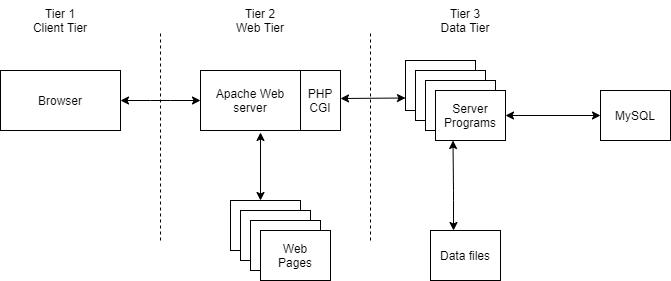
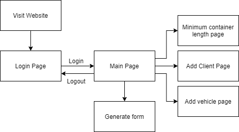
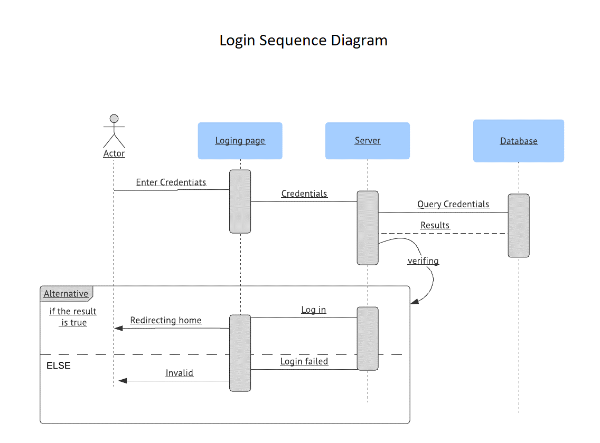

# CP476 Group Project: Warehouse management

### Group members

1. Ismail Kabar
1. Abdirahman Yassin
1. Faiq Ahmed
1. Ryan Jiffri

## Introduction

A webapp to improve workflow of managing car warehouse inventory and client information for use when shipping.

## Problem solving and algorithm

1. Easily insert data into a database for cars and clients and ability to modify/see data at a glance.
2. We will also be using the an algorithm to calculate the size of a container for the car shipment. It will recommend a minimum container size depending on the length of vehicles shipped.

## System Design

{width=600px}

{width=600px}

{width=600px}

## Requirements and specifications

##### Technical requirements (or tools to be used):

1. Apache webserver
1. mySQL
1. XAMPP
1. PHP 8.0.1 (or newer)

##### Specification:
- Web design specifics 
    - HTML with PHP CGI components.
    - Static Webpages
    - Login page
    - Home page
    - Vehicle view page
    - Client view page
    - client object
        - id(primary key)
        - name
        - address
        - phone number
    - vehicle
        - id(primary key)
        - VIN
        - make
        - model
        - year
        - colour
        - clientID (foreign key) (not required)
- Software requirements
  - Any OS to run XAMPP
- Constraints
  - Only accessible via web browser that supports HTML.
  - in order to change requirement for extra fields or add/remove features the app code must be modified.

## Development phases :

1. Planning
2. Assignment: assign each team members gets assigned their parts.
3. Building: creating the site layout, content, design and implementing functionalities.
4. Testing: testing cross browser performance and content rendering.
5. Optimization: this phase requires reviewing project checklist to make sure all requirements met and improve performance based on the result from the testing phase.
6. Final : final review is required amongst team members and submit the project.

## Milestones & schedule

#### schedule
| Task ID | Description                                                                                           | Deadline        |
|---------|-------------------------------------------------------------------------------------------------------|-----------------|
| 1       | Set up development environment and resolve dependencies for each group member.                        | March 23rd 2021 |
| 2       | Setup structure of project with respect to system architecture design laid out in the specifications. | March 25th 2021 |
| 3       | Research and setup of HTML and CSS                                                                                  | March 31st 2021 |
| 4       | Implement Login/logout system with database connection                                                | April 3rd 2021       |
| 5       | Test system and fix bugs                                                                              | April 8th 2021       |
| 6       | Finalize documentation and prepare presentation                                                       | April 9th 2021       |
| 7       | Submit and present                                                                                    | April 10th 2021      |

#### Tasks
| Task                      | Description                                                                                      | Members                       |
|---------------------------|--------------------------------------------------------------------------------------------------|-------------------------------|
| Login system              | PHP system for checking login credentials and allowing users to access functionality of website. | Ryan Jiffri, Ismail Kabar     |
| User Interface for pages  | HTML and CSS to design the pages to look good.                                                   | Ismail Kabar, Faiq Ahmed      |
| Database design           | Design database with relations                                                                   | Ryan Jiffri, Abdirahman Yassin|
| Documentation and testing | Document and test components as they are implemented                                             | Faiq Ahmed, Abdirahman Yassin |
| Presentation              | Present project                                                                                  | Ryan Jiffri                   |

## project deliverables

A functional website that runs on a local network Apache server. How to use the website document.

## References

Any external references go here.
references will be added later

