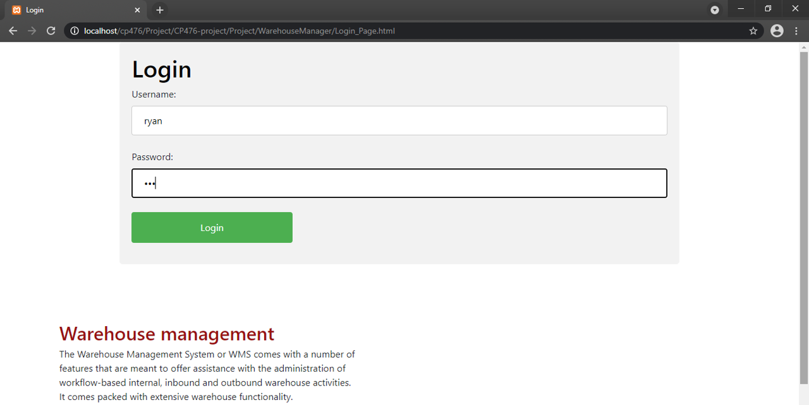
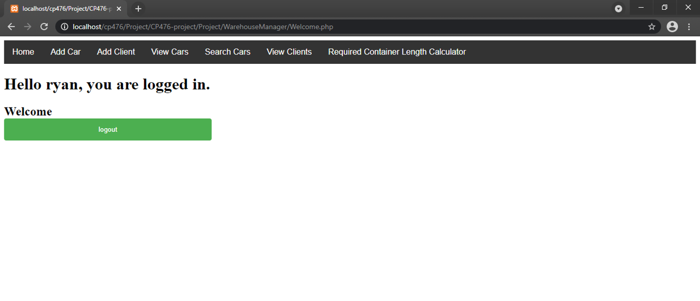
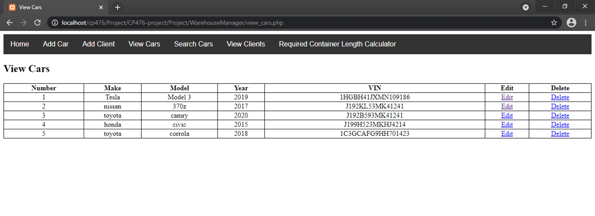
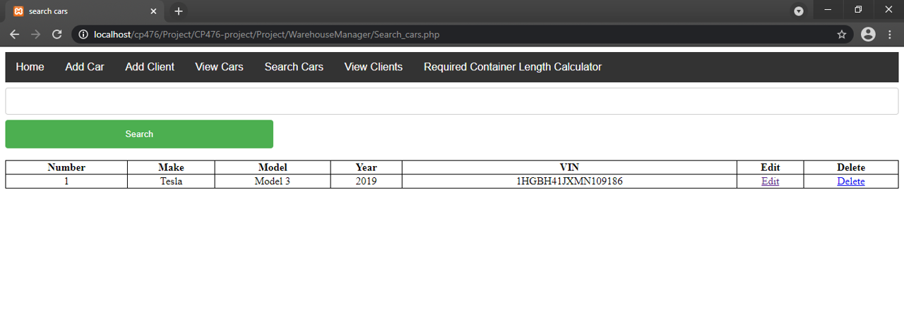
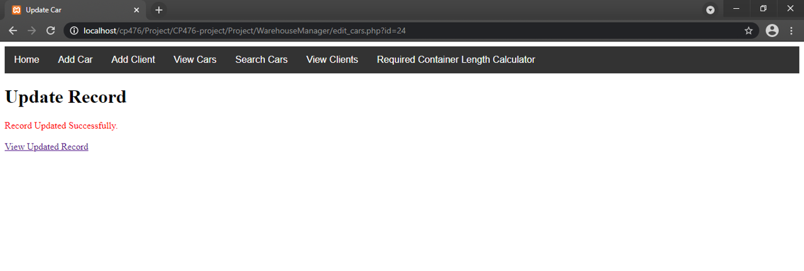
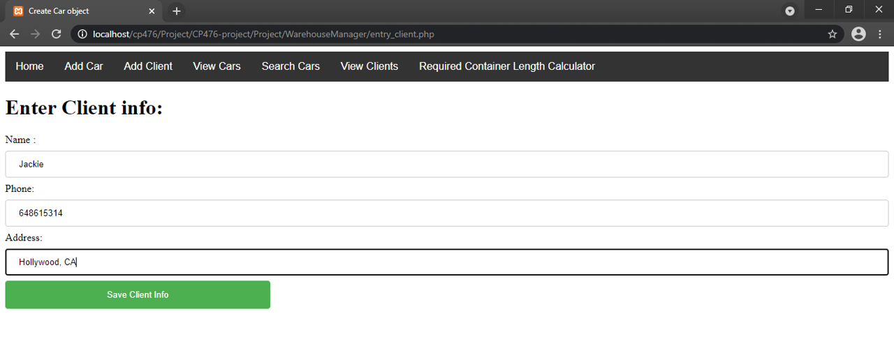
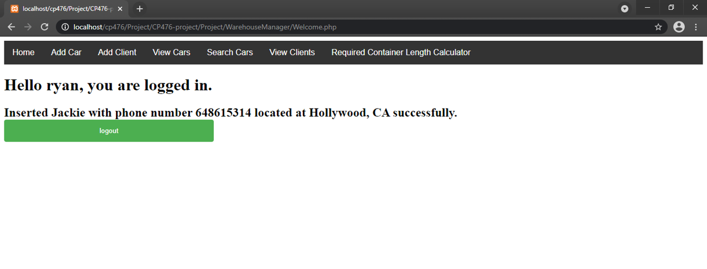
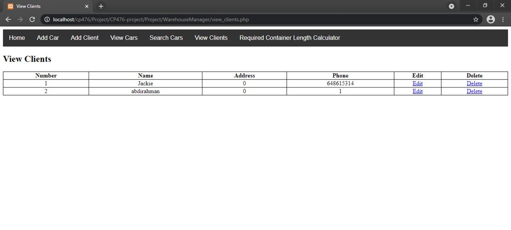

# CP476 Group Project: Warehouse management - Using the Application

## 1. Dependancies

1. Apache webserver
2. MySQL

## 2. Running

1. Can be deployed to run using LAMP (for linux) or XAMPP (for windows)

## 3. Importing database to MySQL.

- Using PHPMyAdmin create database named 'warehousedb'
- Import warehousedb.sql from root project directory ./WarehouseManager/warehousedb.sql into the newly created database.

## 4. Adding users to database

- In PHPMyAdmin select the users table and insert a user with username and password, we will use this for login.

## 5. Logging in

- go to WarehouseManager/Login_Page.html and enter credentials that were inserted in section 4.

{width=600px}

{width=600px}

## 6. Adding cars to the database

- In the navbar go to 'Add Car' and enter car information then press 'Save car Info'

{width=600px}

## 7. Editing and removing cars to the database

- In the navbar go to 'View Cars' or 'Search Cars'. If you go to search cars enter criteria to search for, it could be model,make,year,vin.
- Find entry you want to edit/delete and select it, if edit is pressed enter new information and click the button.

{width=600px}

{width=600px}

{width=600px}

## 8. Adding Client to the database

- In the navbar go to 'Add Client' and enter Client information then press 'Save Client Info'.
- If succesfull a message will show confirming the addition in the 'Home' page.

{width=600px}

{width=600px}

## 9. Editing and removing cars to the database

- In the navbar go to 'View Clients'.
- Find entry you want to edit/delete and select it, if edit is pressed enter new information and click the button.

{width=600px}

## 10. Using Minimum Container Length Calculator

- In the navbar go to 'Required Container Length Calculator'.
- Enter the lengths of the cars you want to ship in container (in meters).
- The result will show if it can fit in 20FT or 40FT with amount of space left (padding in meters) to use as extra space for shipping more goods.

{width=600px}