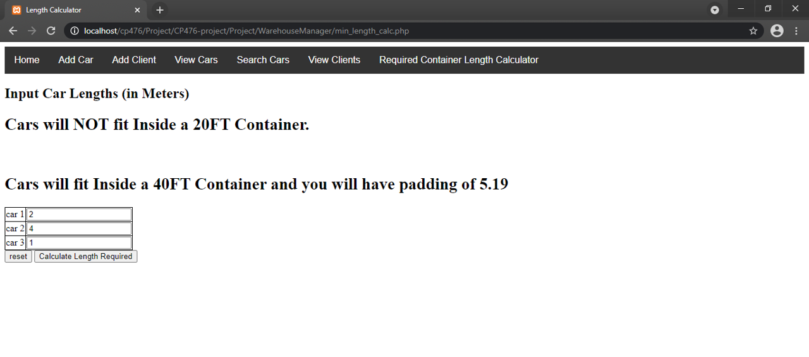
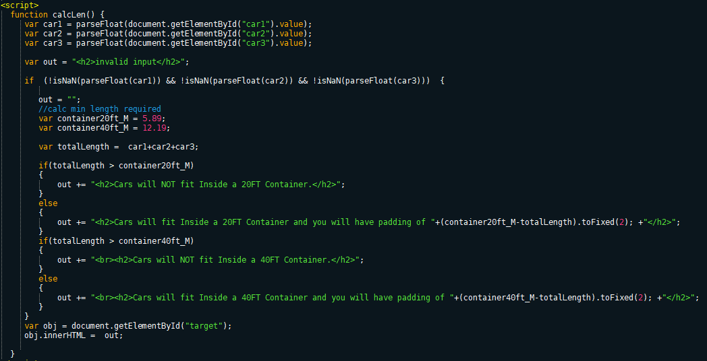

# WarehouseManager Project Report

### Group members

1. Ismail Kabar
1. Abdirahman Yassin
1. Faiq Ahmed
1. Ryan Jiffri

## P2.1 Client side component & UI        
- For client side we used HTML and CSS with javascript for the container length calculator.
- For navbar we used JS mad included in every page.
 
{width=600px}

{width=600px}

{width=600px}

------

## P2.2 Server side CGI components    
- For server side we used PHP to connect to Database and convey information to the user.
- We also used session variables with PHP to control user login and only allow authorized access to the other pages.

{width=600px}

------

## P2.3 Database tier design, data, usage  
- For the database we used MySQL and we used PHPMyAdmin to create and import databases and create user login accounts. For the database design we designed tables for clients and cars.

- clients table
    - id
    - name
    - address
    - phone number
- cars table
    - id
    - vin
    - make
    - model
    - year
    - colour
- users table
    - username
    - password

{width=600px}

-------

## P2.4 New features and tools  
- For new tools and features we implemented a search function for the cars database and a minimum container length required calculator.

{width=600px}

{width=600px}

------

## P2.5 Problem solving algorithms  
- For the the minimum container length required claculator, we can calculate the total length of cars that will be shipped, and we can compare with the size of the standard ISO containers. Using the results we can then tell the user if the containers will fit and the padding that will be available if it does fit.

{width=600px}

------

## P2.6 Efficiency and robustness 
- For the UI we used simple HTML and some Javascript for the container calculator and navbar. The simplicity of the UI design enables the user to navigate with ease and less chance of error to occur.
- For the Database we used simple SQL datatype constraints such that the user cannot enter invalid data into the database. We also made sure to use a universal db.php and include it whenever we use the database so that if it requires change it would only have to be edited in one file.

-----
